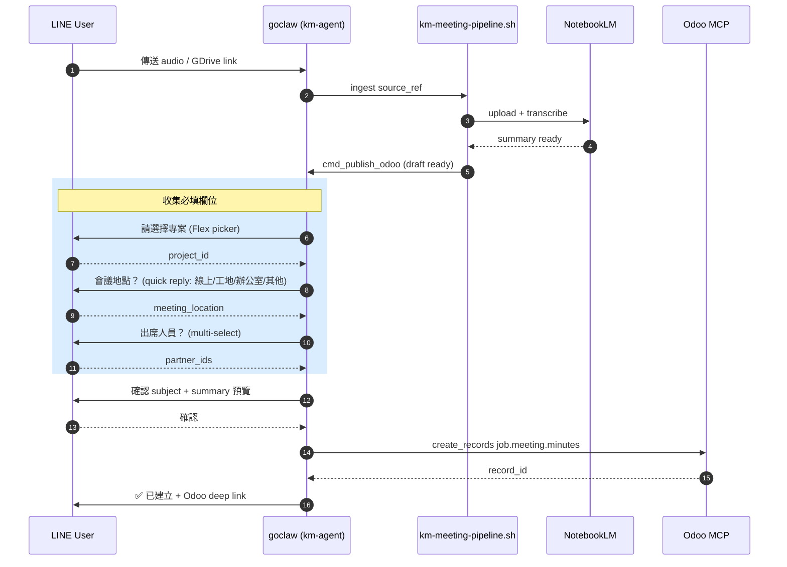

# KM Meeting Upload — LINE → Odoo 會議紀錄寫回

## 1. 概述

當 LINE 用戶傳送會議錄音或 Google Drive 分享連結到 km-agent / e-smith-hub 時，goclaw 會先由 `scripts/km-meeting-pipeline.sh` 將檔案 ingest 到 NotebookLM (nlm) 進行轉錄與摘要。**本 skill 在 nlm summary 完成後啟動**，負責透過 LINE 多輪對話收集 Odoo `job.meeting.minutes` 必填但無法自動推導的欄位（project / location / attendees），最後透過 Odoo MCP 建立紀錄並回傳 deep link 給用戶。

skill 本身不管理 draft state — 該責任在 `km-meeting-pipeline.sh` 的 file-first state machine（`/data/km/meetings/drafts/{source_ref}.json`）。本 skill 提供 pipeline 的 `cmd_publish_odoo` 步驟所需的對話邏輯與 MCP 呼叫範本。

## 2. 對話流程 (Conversation Flow)



色碼：success `#51cf66`、info `#339af0`、error `#ff6b6b`。

## 3. 必收集的欄位 (Field Collection Matrix)

| Field | required | Source | 對話動作 |
|---|---|---|---|
| `subject` | ✅ | nlm summary 首段 | 自動填，最後步驟讓 user 確認 |
| `user_id` | ✅ | LINE uid → res.users.oauth_uid 反查 | 自動 |
| `meeting_date` | ✅ | LINE message timestamp | 自動 |
| `meeting_minutes` | ✅ | nlm summary Html | 自動填 |
| `project_id` | ✅ | 無對映 | **必問** quick picker |
| `meeting_location` | ✅ | 無對映 | **必問** quick reply |
| `partner_ids` | ✅ | 無對映 | **必問** multi-select |
| `job_type_id` | ❌ 已放寬 | 無對映 | 可跳過 quick reply |
| `job_working_plan_id` | ❌ 已放寬 | 依 project_id filter | 可跳過 quick picker |

## 4. LINE user → res.users 解析

LINE OAuth 綁定資料儲存在 `res.users.oauth_uid`（provider 為 LINE）。在進入對話前必須先解析使用者：

```bash
odoo-mcp call execute_method '{
  "model": "res.users",
  "method": "search_read",
  "args": [[
    ["oauth_uid", "=", "<LINE_USER_ID>"],
    ["oauth_provider_id.name", "ilike", "line"]
  ], ["id", "login", "name"]],
  "kwargs": {"limit": 1}
}'
```

若查無對映，立即回覆 LINE 並中斷流程：

```
尚未綁定 Odoo 帳號，請回覆 /bind {你的 e-smith email} 完成綁定
```

成功後，後續所有 MCP 呼叫使用 `--user <login>` 切換身份，遵循該使用者的權限與 record rules。

## 5. Project / Working Plan / Job Type quick picker queries

### project_id picker（必問）

取出該使用者最近活躍的專案，作為 LINE Flex picker 候選清單：

```bash
odoo-mcp --user <user_login> call search_records '{
  "model": "project.project",
  "domain": [["active", "=", true]],
  "fields": ["id", "name"],
  "limit": 10,
  "order": "write_date desc"
}'
```

### partner_ids multi-select（必問）

選定 project 後，從專案成員 + 客戶聯絡人撈出可選人員：

```bash
odoo-mcp --user <user_login> call execute_method '{
  "model": "project.project",
  "method": "read",
  "args": [[<SELECTED_PROJECT_ID>], ["partner_id", "user_ids", "message_partner_ids"]]
}'
```

### job_working_plan_id picker（可選）

依選定 project 過濾，使用者也可以跳過：

```bash
odoo-mcp call search_records '{
  "model": "job.working.plan",
  "domain": [["project_id", "=", <SELECTED_PROJECT_ID>], ["active", "=", true]],
  "fields": ["id", "name"],
  "limit": 20
}'
```

### job_type_id picker（可選）

```bash
odoo-mcp call search_records '{
  "model": "job.type",
  "domain": [["job_type", "=", "labour"]],
  "fields": ["id", "name"]
}'
```

## 6. Create job.meeting.minutes via Odoo MCP

收齊欄位後一次寫入。`partner_ids` 用 Odoo 標準 `[(6, 0, [...])]` 取代：

```bash
odoo-mcp --user <user_login> call create_records '{
  "model": "job.meeting.minutes",
  "values": {
    "subject": "<NLM_SUMMARY_TITLE>",
    "user_id": <RESOLVED_USER_ID>,
    "meeting_date": "<ISO_TIMESTAMP>",
    "meeting_location": "<USER_REPLY>",
    "project_id": <SELECTED_PROJECT_ID>,
    "partner_ids": [[6, 0, [<PARTNER_ID_1>, <PARTNER_ID_2>]]],
    "meeting_minutes": "<HTML_SUMMARY>",
    "job_type_id": <OPTIONAL_OR_NULL>,
    "job_working_plan_id": <OPTIONAL_OR_NULL>,
    "km_source_type": "line_audio",
    "km_source_ref": "line:<CHAT_ID>/<MESSAGE_ID>",
    "km_source_url": "<ORIGINAL_LINE_DEEP_LINK>"
  }
}'
```

**`km_source_ref` UNIQUE constraint**：當捕捉到 `IntegrityError` 時，幾乎都是 LINE webhook retry 重複觸發。skill **不應** 以 error 回應，而是改回覆「此會議已建立過 ({existing_url})」並結束流程。對應的 fallback 查詢：

```bash
odoo-mcp call search_records '{
  "model": "job.meeting.minutes",
  "domain": [["km_source_ref", "=", "line:<CHAT_ID>/<MESSAGE_ID>"]],
  "fields": ["id", "subject"],
  "limit": 1
}'
```

## 7. Final LINE reply with Odoo deep link

成功 create 後，回覆訊息格式：

```
✅ 會議紀錄已建立: {subject}
📅 {meeting_date}
🔗 https://esmith.odoo.com/odoo/action-{ACTION_ID}/{RECORD_ID}
```

`ACTION_ID` 使用 Odoo 18 deep link 格式。第一次取值後可 cache，查詢方式：

```bash
odoo-mcp call search_records '{
  "model": "ir.actions.act_window",
  "domain": [["res_model", "=", "job.meeting.minutes"]],
  "fields": ["id", "name"],
  "limit": 1
}'
```

## 8. Draft state machine integration

本 skill 假設 `scripts/km-meeting-pipeline.sh`（goclaw VPS 上）已實作 file-first draft state machine：

- Draft 路徑：`/data/km/meetings/drafts/{source_ref}.json`
- skill 由 pipeline 的 `cmd_publish_odoo` 步驟呼叫
- skill 不負責持久化 draft，只負責對話 + MCP 呼叫
- 完整架構見 esmith-specs vault 中的 change `km-meeting-odoo-writeback`

## 9. Error handling

| Error | Reply |
|---|---|
| LINE user not bound | `尚未綁定 Odoo 帳號，請 /bind {email}` |
| User has no active projects | `找不到你可存取的專案，請先在 Odoo 加入專案再試` |
| MCP IntegrityError on km_source_ref | `此會議已建立過 ({existing_url})` |
| Odoo MCP timeout | `Odoo 暫時無回應，draft 已保留，10 分鐘後自動重試` |
| User tap "取消" mid-flow | `已取消，draft 保留 24 小時，可再次回覆繼續` |
